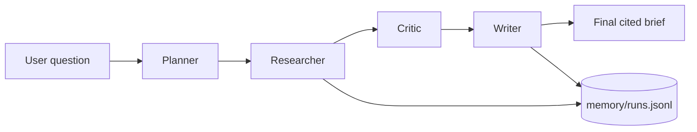

# Local Research Agent

A beginner-friendly Python project for learning how agents work. It starts as a single research pipeline and is already split into simple multi-agent roles:

- **Planner** turns a user question into research subtasks.
- **Researcher** searches or reads provided URLs and extracts notes.
- **Critic** flags weak evidence and hallucination risk.
- **Writer** produces a short cited brief.

The project is local-first. It can call Ollama at `http://localhost:11434` if available, but it still runs without Ollama by using a deterministic fallback plan.

## Quick Start

```bash
python main.py "What are the best ways to evaluate RAG systems?"
```

Use explicit source URLs when you want repeatable, more reliable runs:

```bash
python main.py "What does the Python docs say about argparse?" \
  --url https://docs.python.org/3/library/argparse.html
```

Print the full state:

```bash
python main.py "How should beginners evaluate AI agents?" --json
```

## Optional Ollama Setup

Install Ollama from https://ollama.com, then pull a small model:

```bash
ollama pull llama3.2:3b
```

The CLI defaults to `llama3.2:3b`. You can choose another local model:

```bash
python main.py "What is agentic RAG?" --model qwen2.5:3b
```

## Architecture



## What Makes It An Agent?

This project uses the basic agent loop:

`goal -> plan -> tool use -> observation -> critique -> final answer`

The tools are intentionally small and readable. That makes the project good for learning before moving to frameworks such as LangGraph.

## Limitations

- Web search uses DuckDuckGo HTML and may fail depending on network restrictions.
- Source extraction is lightweight HTML parsing, not a full browser.
- The writer only uses extracted source notes; if no notes are available, it refuses to make factual claims.
- This is a learning project, not a production research system.

## Suggested Next Improvements

- Add a Streamlit UI.
- Add SQLite memory and search over past runs.
- Replace lightweight search with a proper search API.
- Add LangGraph once the hand-rolled pipeline feels clear.
- Add richer evals for citation coverage and source diversity.
